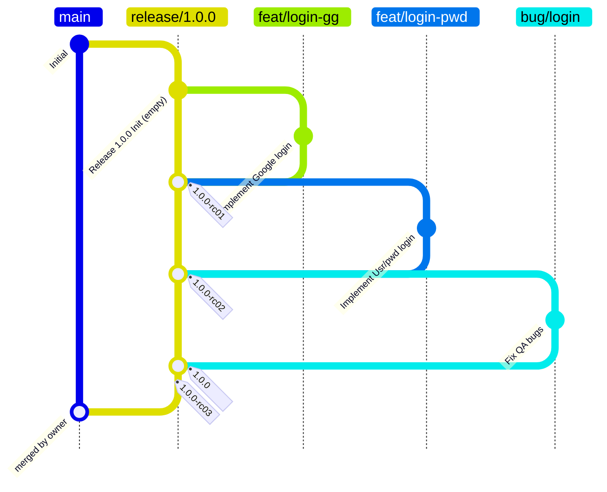
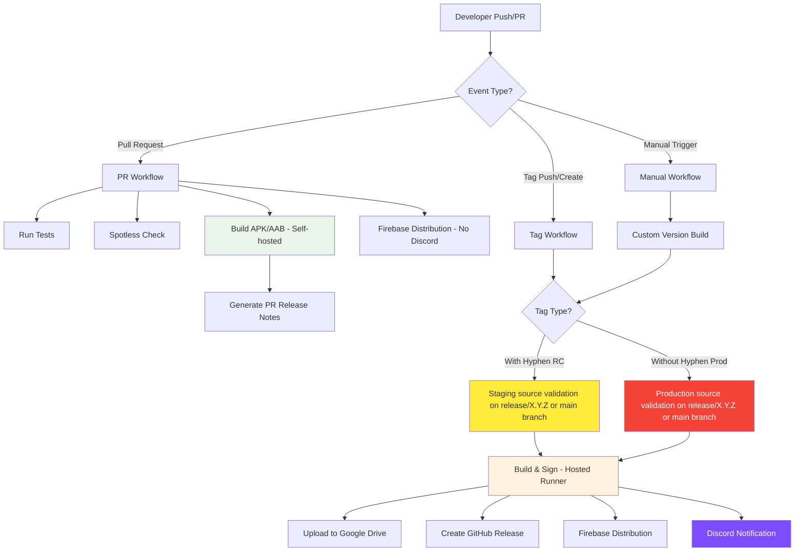
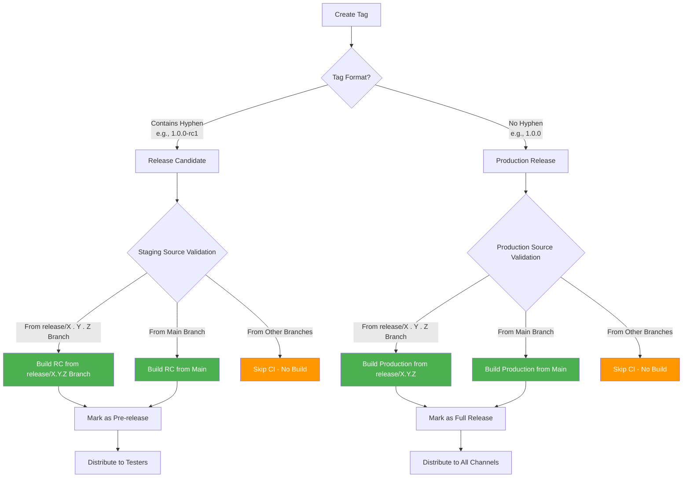
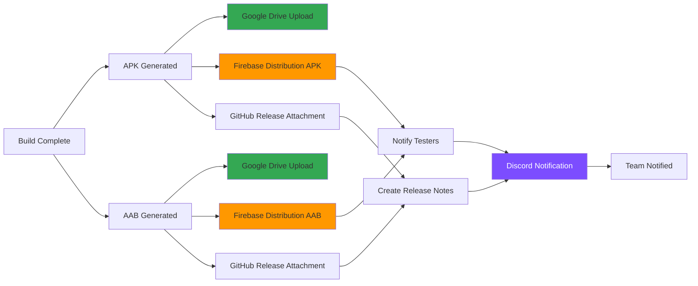
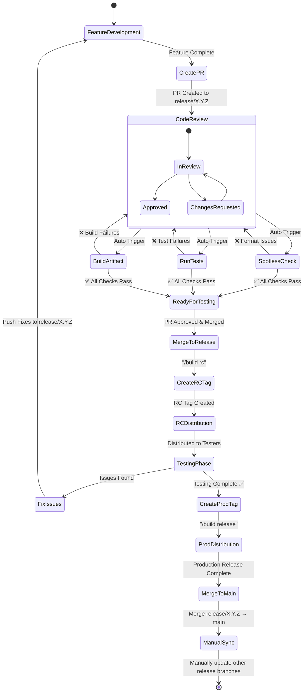
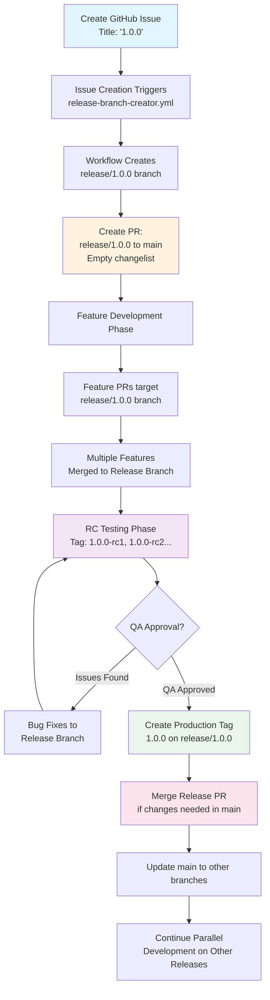
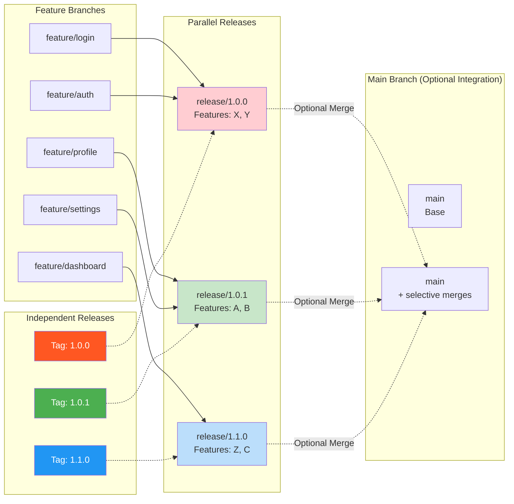

# GitHub Workflow Documentation

## Overview

This Android project implements a sophisticated CI/CD pipeline with GitHub Actions that supports
multiple build triggers, automated testing, code formatting checks, and multi-platform distribution.
The workflow is designed around a feature-branch development model with pull request reviews and
tag-based releases, enhanced with **parallel release branch management** for concurrent release
development.

## Visual Workflow Diagrams

### Git Flow Strategy

- `main`: prohibit push, commit, PR only
- `release/*.*.*`: prohibit push, commit, PR only
- other branches: no restriction



- commit `(same commit as rc03)` (tag `1.0.0`) is the same as tag `1.0.0-rc03`. I put it in a 
separate commit bc Jetbrains Mermaid plugin is updated and there isn't a way to represent 2 tags 
on the same commit
- **Important**: When a release branch is merged into main, all other active release branches should
  be manually updated with those changes to maintain consistency

### CI/CD Pipeline Flow



---

## Tag Creation from PR Comments

### Branch Authorization

Tags can only be created from PRs where the **source branch** (head branch) follows these patterns:

- `main` - Main development branch
- `release/X.Y.Z` - Release branches (e.g., `release/1.0.0`, `release/2.1.3`)

The PR's target branch (base branch) can be any branch, but the tag will be created on the source
branch.

### Command Types

1. **Smart RC Command**: `/build rc`
    - Only works on `release/X.Y.Z` branches
    - Automatically determines next RC number (e.g., `1.0.0-rc01`, `1.0.0-rc02`)
    - Creates release candidate tag for testing

2. **Production Release Command**: `/build release`
    - Only works on `release/X.Y.Z` branches
   - **Enforced:** Production release tag (`1.0.0`, without hyphen) can only be created on the *
     *same commit** as an existing RC tag for that release (e.g., `1.0.0-rcN`). If no RC tag exists
     on the commit, production tagging is blocked.
    - Creates production tag using branch version (e.g., `1.0.0`)
    - Ready for production distribution

3. **Legacy Tag Command**: `/tag X.Y.Z-suffix`
    - Works on any authorized branch (`main` or `release/X.Y.Z`)
    - Creates custom tag with specified version
    - Flexible for custom versioning schemes

### Examples

```
Source Branch: release/1.0.0 → Target Branch: main
Comment: /build rc → Creates tag: 1.0.0-rc01 on release/1.0.0

Source Branch: release/1.0.0 → Target Branch: main  
Comment: /build release → Creates tag: 1.0.0 on release/1.0.0

Source Branch: main → Target Branch: develop
Comment: /tag 2.0.0-beta1 → Creates tag: 2.0.0-beta1 on main
```

### Release Strategy Decision Tree



### Distribution Workflow



### Development Lifecycle



## Parallel Release Branch Strategy

### Overview

This enhanced workflow supports **parallel release development** where multiple releases can be
developed simultaneously. Each release gets its own long-lived branch that can evolve independently,
allowing teams to work on different feature sets for different releases in parallel.

### Release Branch Lifecycle



### Branch Hierarchy & Merge Strategy



## New Workflow Files

### 5. Release Branch Creator (`release-branch-creator.yml`)

**Triggers:**

- GitHub Issues with specific title format
- Manual workflow dispatch with commit hash input

**Functionality:**

- **Issue Detection**: Triggers when issue title matches semantic version pattern (e.g., "1.0.0", "
  2.1.0")
- **Commit Hash Support**:
    - For issues: Reads commit hash (minimum 7 characters) from issue description, defaults to "
      main" if not provided
    - For manual dispatch: Accepts commit hash as input parameter
- **Branch Creation**: Creates `release/X.Y.Z` branch from the specified commit hash
- **PR Generation**: Automatically creates PR from `release/X.Y.Z` → `main` with:
   - Empty changelist initially
   - Template description for release tracking
   - Labels for release management
  - Milestone linking to the triggering issue (for issue-triggered creation)

**Issue Description Format:**

```markdown
Base commit: abc1234
<!-- or -->
Base commit: main

Release planning details, feature list, timeline...
```

**Branch Naming Convention:**

- Format: `release/X.Y.Z` (e.g., `release/1.0.0`, `release/2.1.0`)
- Matches the issue title exactly

**PR Template Contents:**

```markdown
# Release X.Y.Z

## 📋 Release Overview
This PR tracks all changes for release X.Y.Z

## 🚀 Features Included
- [ ] Feature A (PR #XXX)
- [ ] Feature B (PR #XXX)

## 🐛 Bug Fixes
- [ ] Fix C (PR #XXX)

## 🧪 Testing Status
- [ ] RC builds tested
- [ ] QA approval received
- [ ] Performance testing passed

## 📝 Release Notes
<!-- Will be auto-generated from merged PRs -->

---
**🔗 Tracking Issue:** Closes #[issue-number]
```

### 6. Enhanced Tag Creation (`tag-on-pr-comment.yml`)

**Trigger:** Comment on pull requests (targeting release branches)

**Functionality:**

- **Smart RC Creation**: Responds to `/build rc` commands
    - Automatically increments RC versions: `-rc01`, `-rc02`, `-rc03`
    - Uses release branch name as version prefix (e.g., for `release/1.0.0` → `1.0.0-rc01`)
- **Production Release**: Responds to `/build release` commands
    - Creates production tag using release branch name (e.g., `1.0.0`)
  - **Production Tag Validation:** The workflow strictly enforces that a production tag (`X.Y.Z`)
    can only be created on a commit that already has a corresponding RC tag for the same release
    version on that branch.
      - **Mechanism:** When a `/build release` command is issued, the workflow retrieves the commit
        hash (SHA) to be tagged as the production release. It then queries all existing tags
        pointing to that commit. The workflow validates that **at least one RC tag** matching the
        release version pattern (e.g., `1.0.0-rcN` for `1.0.0`) already exists on this commit.
      - **If no such RC tag exists on the commit, production tagging is denied and the workflow
        aborts with an error comment.** This prevents accidental production tags being created on
        commits that haven't undergone RC validation or testing.
      - **Example:** For a `release/1.0.0` branch, attempting `/build release` on commit `abc1234`
        will succeed only if there is already a tag with the pattern `1.0.0-rc*` that points to
        `abc1234`. If not, the workflow stops and notifies the user, requiring them to first create
        an RC tag on that commit and pass CI.
- **Legacy Support**: Still supports `/tag X.Y.Z-rcN` commands for manual RC numbering
- **Permission Validation**: Only users with write access can create tags
- **Source Branch Validation**: **Tags can only be created on PRs whose source branch (head branch)
  is `main` or matches `release/X.Y.Z` pattern**
    - ⚠️ **Important**: The workflow validates the PR's **source branch** (head branch), not the
      base branch
    - Tags are created on the PR's **head commit** (source branch), but only if the source branch is
      authorized
    - This ensures tags are only created from source branches intended for authorized release or
      main development
- **Automatic Response**: Comments back with success/failure status

**Commands:**

- `/build rc` → Creates next RC tag (e.g., `1.0.0-rc01`, `1.0.0-rc02`)
- `/build release` → Creates production tag (e.g., `1.0.0`)
- `/tag 1.0.0-rc05` → Creates specific RC tag (legacy support)

**Security:**

- Uses GitHub API to verify commenter permissions
- **Validates PR source branch** (head branch) is `main` or matches `release/X.Y.Z`
- **Creates tag on PR head commit** (source branch) after validation passes
- Requires `PAT_TAG_ON_PR_COMMENT_TOKEN` with appropriate scopes

#### 1. Release Planning Phase

```bash
# Method 1: Create GitHub issue with release version as title
# Title: "1.0.0"
# Description: 
# Base commit: abc1234
# Release planning details, feature list, timeline

# Method 2: Manual workflow dispatch
# Go to Actions → Release Branch Creator → Run workflow
# Input: version=1.0.0, commit_hash=abc1234

# Workflow automatically:
#    - Creates release/1.0.0 branch from specified commit
#    - Creates PR: release/1.0.0 → main
#    - Links PR to issue (for method 1)
```

#### 2. Feature Development Phase

```bash
# Developers create feature branches targeting appropriate branches
# Feature branches can target either main or release/X.Y.Z (no restrictions)

# For release-specific features:
git checkout release/1.0.0
git checkout -b feature/user-authentication-1.0.0

# For general features:
git checkout main
git checkout -b feature/general-improvement

# Feature development happens
git add .
git commit -m "Add user authentication"
git push origin feature/user-authentication-1.0.0

# Create PR targeting appropriate branch:
# - For release features: feature/user-authentication-1.0.0 → release/1.0.0
# - For general features: feature/general-improvement → main
```

#### 3. Release Candidate Phase

```bash
# When release branch is ready for testing
# Comment on release PR (release/1.0.0 → main):
# "/build rc"    # Creates 1.0.0-rc01, then 1.0.0-rc02, etc.

# Alternative: Manual RC creation on GitHub Releases page
# Alternative: Legacy command "/tag 1.0.0-rc05" for specific RC numbers
```

#### 4. Release Completion Phase

```bash
# After QA approval, create production tag
# Comment on release PR: "/build release"    # Creates 1.0.0 tag

# MANDATORY: Merge release PR into main
# This ensures all changes are integrated into main branch

# MANUAL: Update other active release branches with main changes
# This maintains consistency across parallel development
```

### Benefits of Parallel Release Strategy

1. **Parallel Feature Development**: Teams can work on different releases simultaneously without
   blocking each other

2. **Flexible Release Timing**: Releases can be completed and shipped independently based on QA
   cycles and business needs

3. **Feature Isolation**: Features in release A don't accidentally affect release B during
   development

4. **Cross-Release Integration**: Releases can selectively include changes from other releases when
   needed

5. **Clear Tracking**: Each release has its own PR for tracking all included changes

6. **A/B Testing Support**: Release branches can be maintained for testing scenarios with selective
   main integration


## Git/GitHub Flow Strategy

### Branch Strategy

- **Main Branch (`main`)**: Production-ready branch with direct push/commit prohibited - PR only
- **Release Branches (`release/X.Y.Z`)**: Long-lived release branches with direct push/commit
  prohibited - PR only
- **Feature Branches**: Developers can create feature branches targeting any branch (no restrictions
  on target branch selection)
- **Pull Request Workflow**: All changes must go through pull requests to be merged into target
  branches

### Git Flow Model

The project follows the **Git Flow Strategy** with parallel release development:

1. **Main Branch Protection**: Direct pushes and commits are prohibited - only PRs allowed
2. **Release Branch Protection**: Direct pushes and commits are prohibited - only PRs allowed
3. **Feature Development**: Features can target any branch - developers have full flexibility in
   choosing target branches
4. **Parallel Releases**: Multiple release branches can be developed simultaneously with different
   feature sets
5. **Mandatory Main Integration**: All release branches **must** be merged back to main after
   production release completion
6. **Manual Sync**: After a release is merged to main, other active release branches should be
   manually updated with those changes

**Tag Creation and CI Execution Strategy:**

- Tags can be created from any branch (no enforcement restrictions)
- **CI Release Jobs only execute for tags created from `release/X.Y.Z` branches or `main` branch**
- Tags created from other branches will **skip CI release jobs** (no build artifacts, no
  distribution)
- This approach allows flexibility while ensuring only authorized branches produce release artifacts
- PR comments trigger workflows that create tags pointing to release branch commits
- This maintains security through branch-based CI execution control rather than tag creation
  restrictions

### Release Strategy

The project uses a **tag-based release system** with **selective CI execution**:

1. **Release Candidates (RC)**: Tags containing hyphens (e.g., `1.0.0-rc1`, `2.1.0-beta2`)
    - CI builds **only execute** when created from **release/X.Y.Z branches or main branch**
    - Tags from other branches skip CI release jobs
    - Successful builds are marked as pre-release in GitHub
    - Used for testing and validation

2. **Production Releases**: Tags without hyphens (e.g., `1.0.0`, `2.1.0`)
    - CI builds **only execute** when created from **release/X.Y.Z branches or main branch**
    - Tags from other branches skip CI release jobs
    - Successful builds are full production releases distributed to all channels
    - Each release maintains strict branch-based CI execution for quality control

## Workflow Files

### 1. Main CI Pipeline (`ci.yml`)

**Triggers:**

- Tag creation/push (any tag)
- Pull request events (opened, synchronize, reopened, ready_for_review)
- Manual workflow dispatch

**Jobs:**

#### `run_tests`

- Runs on self-hosted Linux runners
- Skips draft PRs
- Executes all project tests using Gradle
- Sets up JDK 21, Android SDK, and Google Services

#### `build_app_artifact`

- Comprehensive build job with multiple responsibilities and runner selection based on trigger type:

**Runner Selection:**

- **Release Artifacts** (tags from `release/X.Y.Z` or `main`): Runs on **hosted runners** for
  production builds
- **PR Artifacts**: Runs on **self-hosted runners** for cost reduction

**Tag Validation:**

- **RC Tags** (with hyphens): Must be created from **release/X.Y.Z branches or main branch only**
- **Production Tags** (without hyphens): Must be created from **release/X.Y.Z branches or main
  branch only**
- Uses GitHub API to verify commit relationships and branch validity

**Version Management:**

- **Pull Requests**: Version name format `PR#number-branch-name`
- **Tags**: Uses tag name as version name
- **Manual Builds**: Uses custom version name from input
- **Nightly Builds**: Format `Nightly-YYYY-MM-DD-hash`
- Version codes use GitHub run number with optional offset

**Build Process:**

- Decodes signing keystore from secrets
- Builds both APK and AAB (Android App Bundle)
- Signs releases with production certificates

**Distribution:**

- **Google Drive**: Uploads APK/AAB for tag builds only (release artifacts)
- **GitHub Releases**: Creates releases with auto-generated notes for tag builds
- **Firebase Distribution**: Distributes to configured testers for all builds
- **Discord Notifications**:
    - **Release Builds** (tags): Announces build completion/failures
    - **PR Builds**: No Discord notifications (cost reduction)

**⚠️ Implementation Note:** The current build configuration, Firebase distribution setup, and Google
Drive integration should **not be modified** during this workflow transition. These configurations
will be supplemented and refined in subsequent phases.

### 2. Enhanced Tag Creation from PR Comments (`tag-on-pr-comment.yml`)

**Trigger:** Comment on pull requests

**Functionality:**

- **Smart RC Creation**: Responds to `/build rc` commands
    - Automatically increments RC versions: `-rc01`, `-rc02`, `-rc03`
    - Uses release branch name as version prefix (e.g., for `release/1.0.0` → `1.0.0-rc01`)
- **Production Release**: Responds to `/build release` commands
    - Creates production tag using release branch name (e.g., `1.0.0`)
- **Legacy Support**: Still supports `/tag X.Y.Z-rcN` commands for manual RC numbering
- **Permission validation**: Only users with write access can create tags
- **Source Branch Validation**: **Tags can only be created on PRs whose source branch (head branch)
  is `main` or matches `release/X.Y.Z` pattern**
    - The workflow validates the PR's **source branch** (head branch), not the base branch
    - Tags are created on the PR's **head commit** (source branch) after validation passes
- **Automatic Response**: Comments back with success/failure status

**Commands:**

- `/build rc` → Creates next RC tag (e.g., `1.0.0-rc01`, `1.0.0-rc02`)
- `/build release` → Creates production tag (e.g., `1.0.0`)
- `/tag 1.0.0-rc05` → Creates specific RC tag (legacy support)

**Security:**

- Uses GitHub API to verify commenter permissions
- **Validates PR target branch** (base branch) is `main` or `release/X.Y.Z`
- **Creates tag on PR head commit** (source branch) after validation passes
- Requires `PAT_TAG_ON_PR_COMMENT_TOKEN` with appropriate scopes

### 3. Code Quality (`spotless.yml`)

**Trigger:** Pull requests to main branch and release/X.Y.Z branches

**Functionality:**

- Runs Spotless code formatting checks
- Ensures consistent code style across the project
- Fails if code doesn't meet formatting standards

### 4. Additional Workflows

- **`remove-old-artifacts.yml`**: Cleans up old build artifacts
- **`sync-template.yml`**: Keeps project synchronized with template updates

## Development Workflow

### Feature Development

1. Developer creates feature branch from target branch (`main` or `release/X.Y.Z`)
2. Implements changes with proper commits
3. Creates pull request to target branch (`main` or `release/X.Y.Z`)
4. Automated checks run:
    - Spotless code formatting validation
    - All tests execution
   - Build artifact generation on **self-hosted runners** (cost reduction)
   - Firebase distribution **without Discord notifications**

### Testing & Release Candidates

1. When ready for testing, authorized team member creates RC tag from **release/X.Y.Z branch or main
   branch** (e.g., `/tag X.Y.Z-rc1`)
2. Tag creation workflow validates branch source and creates RC tag
3. CI pipeline builds on **hosted runners** and distributes RC to:
    - Firebase Distribution (for testers)
    - Google Drive (for storage)
    - GitHub Releases (marked as pre-release)
4. Discord notifications inform team of new RC availability

### Production Release

1. Development is completed on the **release/X.Y.Z branch** or **main branch**
2. Authorized team member creates production tag (e.g., `1.0.0`) from **release/X.Y.Z branch or main
   branch**
3. CI pipeline validates tag is from authorized branch (release/X.Y.Z or main)
4. Builds on **hosted runners** and distributes production release to all channels
5. Creates GitHub release with auto-generated release notes
6. Discord notifications announce production release completion

### Manual Builds

- Workflow dispatch allows manual builds with custom version names
- Useful for hotfixes or special testing scenarios
- Build artifacts depend on trigger context (hosted vs self-hosted runners)

## Security & Configuration

### Required Secrets

- `SIGNING_KEY_STORE_BASE64`: Android keystore for app signing
- `SIGNING_KEY_ALIAS`, `SIGNING_STORE_PASSWORD`, `SIGNING_KEY_PASSWORD`: Keystore credentials
- `GOOGLE_SERVICES_JSON`: Firebase configuration
- `FIREBASE_DISTRIBUTION_CREDENTIAL_JSON`: Firebase service account
- `GG_DRIVE_CREDENTIAL_JSON_BASE64`: Google Drive API credentials
- `DISCORD_WEBHOOK`: Discord notifications
- `PAT_TAG_ON_PR_COMMENT_TOKEN`: GitHub token for tag creation

### Repository Variables

- `VERSION_CODE_OFFSET`: Optional offset for version codes
- `FIREBASE_DISTRIBUTION_SKIP_APK/AAB`: Toggle distribution uploads
- `GG_DRIVE_FOLDER_ID`: Target Google Drive folder

## Key Features

### Selective CI Execution System

- Enforces release governance by executing CI builds **only for tags from release/X.Y.Z branches or
  main branch**
- Tags from unauthorized branches skip CI release jobs entirely
- Prevents accidental production releases from unauthorized branches
- Supports controlled RC workflow from approved branches only

### Multi-Platform Distribution

- Firebase Distribution for internal testing
- Google Drive for backup and sharing (release builds only)
- GitHub Releases for version management
- Discord integration for team notifications (release builds only)

### Runner Optimization

- **Hosted Runners**: Used for release artifacts (tags) to ensure production build reliability
- **Self-Hosted Runners**: Used for PR builds to reduce costs
- **Test Execution**: Always on self-hosted runners for consistency

### Comprehensive Build Information

- Detailed version naming based on trigger type
- Release notes generation from PR information
- Build artifact tracking and storage
- Context-aware distribution (release vs development builds)


## Best Practices Implemented

1. **Selective CI Execution**: Only builds releases from authorized branches
2. **Flexible Tag Creation**: No restrictions on where tags can be created
3. **Branch-Based Quality Control**: CI execution tied to branch authorization rather than tag
   restrictions
4. **Concurrency Control**: Cancels in-progress builds for same branch
5. **Draft PR Handling**: Skips CI for draft pull requests
6. **Error Handling**: Comprehensive error reporting via Discord
7. **Security**: Branch-based CI execution control
8. **Traceability**: Links builds to commits, PRs, and releases
9. **Automation**: Minimal manual intervention required for releases

This workflow setup enables a robust, automated development and release process suitable for
professional Android development teams with flexible development practices and strict release
governance.
